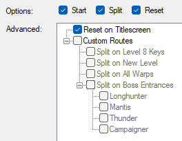

# LiveSplit Autosplitter for Turok: Dinosaur Hunter Remastered

Supports Steam version, patches 1.4.3, 1.4.6, 1.4.7, and 2.0

Auto-start, auto-split, and auto-reset. You should be able to run all current categories using all current techniques, including zombie mode, with the default settings.

For issues and support please join the [Turok Speedrunning Discord](https://discord.gg/C8vczW2)

---

## Split Files for Known Routes

These files have been tested and are known to work for their route.

[Any%](https://raw.githubusercontent.com/Mibz/LiveSplit.ASL.Turok/main/turok-any%.lss)

This route has fewer splits than the Beginner due to Reset Wall Skip. You can still run a non-RWS route using this file, you will just have a warp without a split.

[Any% Beginner](https://raw.githubusercontent.com/Mibz/LiveSplit.ASL.Turok/main/turok-any%-beginner.lss)

This route is not entirely glitchless but limits the techniques to ones that are easier and/or less random to perform. The community recommends new runners start with this.

[Randomizer](https://raw.githubusercontent.com/Mibz/LiveSplit.ASL.Turok/main/turok-randomizer.lss)

This route was created for Randomizer runs and, prior to The Final Confrontation, only splits on the collection of Level 8 keys.

---

## Settings

### Defaults

### Options

**Start**, **Split**, and **Reset** should be self-explanatory.

**Reset on Titlescreen**: Disable this if you want the ability to continue from a save after a Game Over, otherwise your run is dead. Check the rules for your category to make sure this is allowed. This setting has no impact on zombie mode.

### Custom Route Options

These settings are only necessary, and only applied, when running a route that the autosplitter does not recognize. The autosplitter looks for keywords in the route/split title and adjusts internal settings automatically. **Even if you enable Custom Routes, these settings will be ignored if a known route is detected**. Check the code to see which words/terms are being looked for and make sure your timer.Run.CategoryName doesn't contain any of them.

Each setting has alt text which explains its purpose, and you can check the code for more details on what each setting does.
